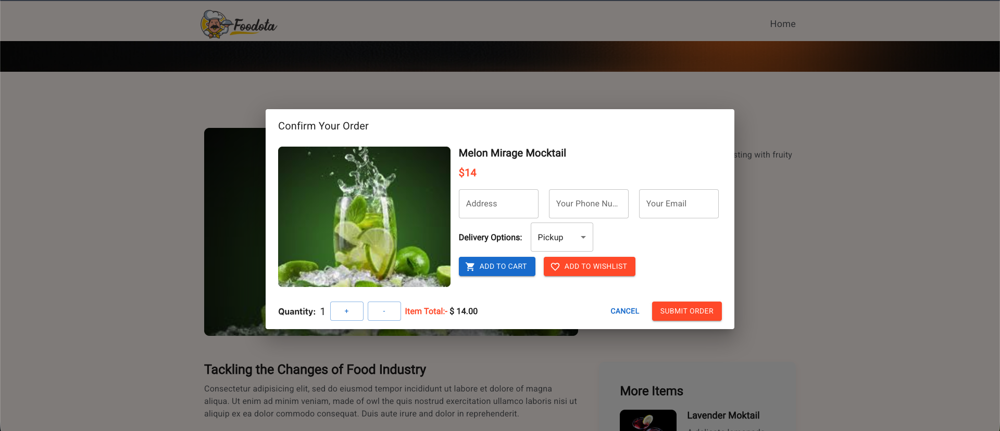

# 🍔 Foodie - Digital Food Delivery Solution

**Project Overview & Concept Document**
**Live Demo:** [https://foodie-2ol4.onrender.com](https://foodie-2ol4.onrender.com)

---

## 💡 Project Concept (Project Idea)

**Foodie** is a modern, web-based food delivery platform designed to bridge the gap between the restaurant and its customers. The primary goal of this project is to provide a seamless, digital ordering experience where customers can browse menus, manage their cart, and place orders directly from their devices without any hassle.

Unlike traditional ordering methods, Foodie offers a **visual-first interface**, making food discovery engaging and the checkout process effortless. It is built to be fast, responsive, and user-friendly.

---

## 🔄 User Workflow (How it Works)

The application follows a logical flow to ensure the user completes their order with minimum clicks.

### 1. Discovery (Home & Menu)
The user lands on the website and sees featured items and categories. They can filter food items (e.g., Pizza, Burger, Salad) to find exactly what they crave.

### 2. Selection (Add to Cart)
Users can view detailed information about the food item (Price, Rating) and add it to their cart with a single click. The cart updates instantly.

### 3. Authentication (Secure Login)
To place an order, the user logs in or signs up. This ensures we capture their delivery details correctly and save their history for future convenience.

### 4. Checkout & Order Placement
The user reviews their cart summary and confirms the order. The system then processes the request and confirms the delivery status.

---

## 📸 Visual Walkthrough & Features

### 1. The Home Experience
The landing page is designed to captivate users immediately. It showcases our "Popular Items," "Services," and "Customer Testimonials" in a clean, scrollable layout.

*Figure 1: Complete overview of the landing page showing the hero section, popular items, and footer.*

### 2. Extensive Digital Menu
We have replaced the traditional PDF menu with an interactive digital catalog. Users can view hundreds of items at a glance, categorized for easy navigation (Burgers, Pizzas, Drinks, etc.).

*Figure 2: The comprehensive menu view allowing users to browse all available categories and items.*

### 3. Smart Order Confirmation
The checkout process is simplified into a smart pop-up. Users can review their selected item (e.g., Melon Mirage Mocktail), confirm their address, choose delivery options (Pickup/Delivery), and see the total cost instantly.

*Figure 3: A sleek order confirmation modal that allows users to verify details before payment.*
---

## ✨ Key Highlights

* **📱 Fully Responsive:** The website adjusts perfectly to Mobile, Tablet, and Desktop screens.
* **⚡ Instant Interactions:** Adding items to the cart happens instantly without reloading the page.
* **🔒 Secure Data:** User passwords and data are handled with industry-standard security.
* **🎨 Modern UI/UX:** A clean, appetizing design that encourages users to order more.

---

## 💻 Technical Documentation (For Developers/IT Team)

*This section is intended for the technical team for future updates or server maintenance.*

**Tech Stack Used:**
* **Frontend:** React.js, Tailwind CSS
* **Backend:** Node.js, Express.js
* **Database:** MongoDB
* **Hosting:** Render

---

## 🏁 Conclusion

**Foodie** is not just a website; it is a scalable solution ready to handle real-world food ordering scenarios. It streamlines the process for the business and simplifies the experience for the customer.

---
*Developed by: [Your Name/Company Name]*
